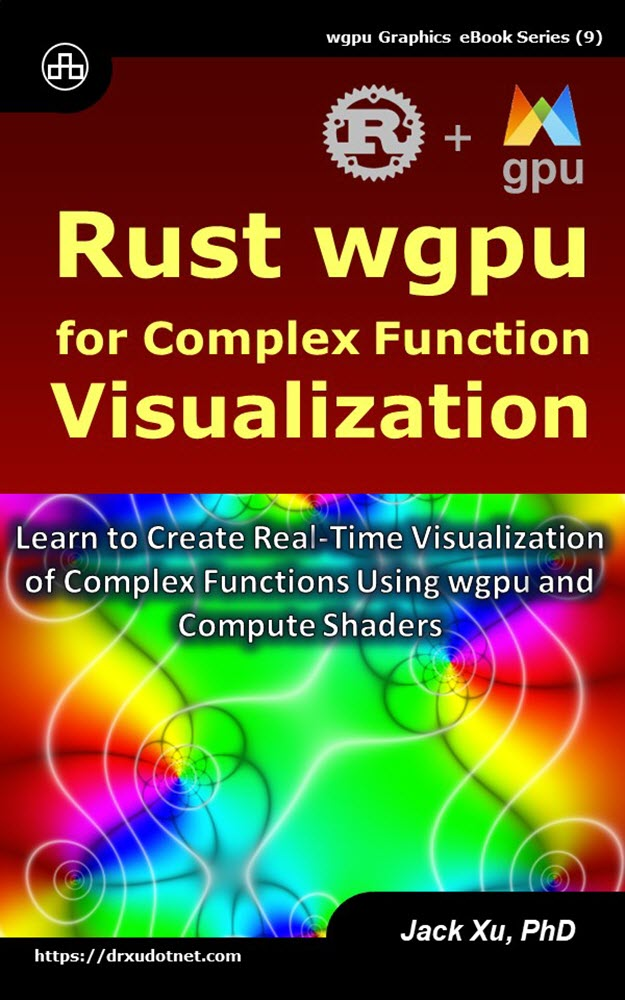

# Rust wgpu for Complex Function Visualization
## Learn to Create Real-Time Visualization of Complex Functions Using wgpu and Compute Shaders

This is the source code of example projects contained in the eBook ["Rust wgpu for Complex Function Visualization"](https://www.amazon.com/exec/obidos/ASIN/B0CLSV3SPT/unicadinccom-20). 

